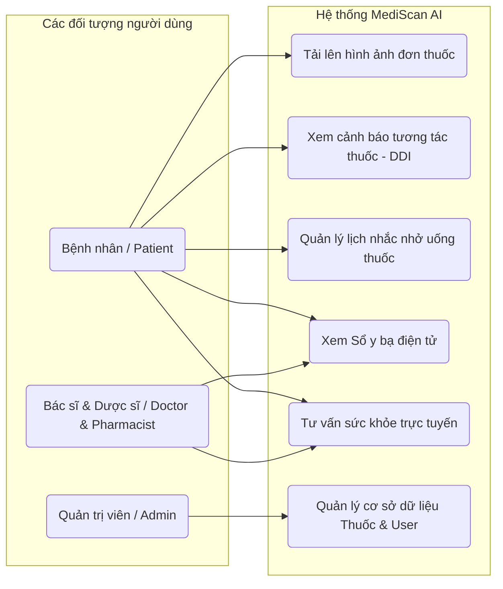
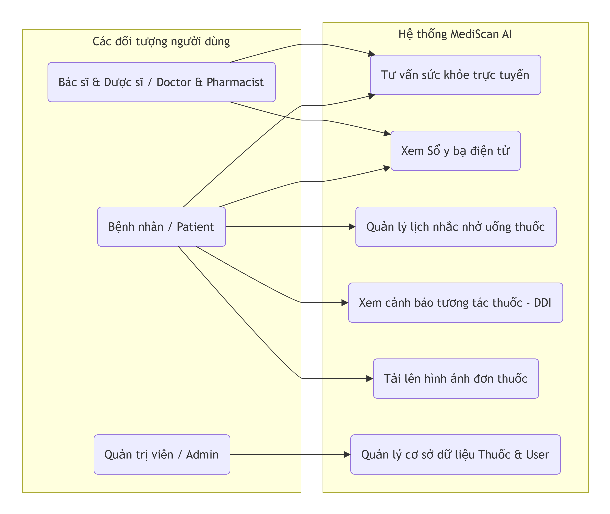
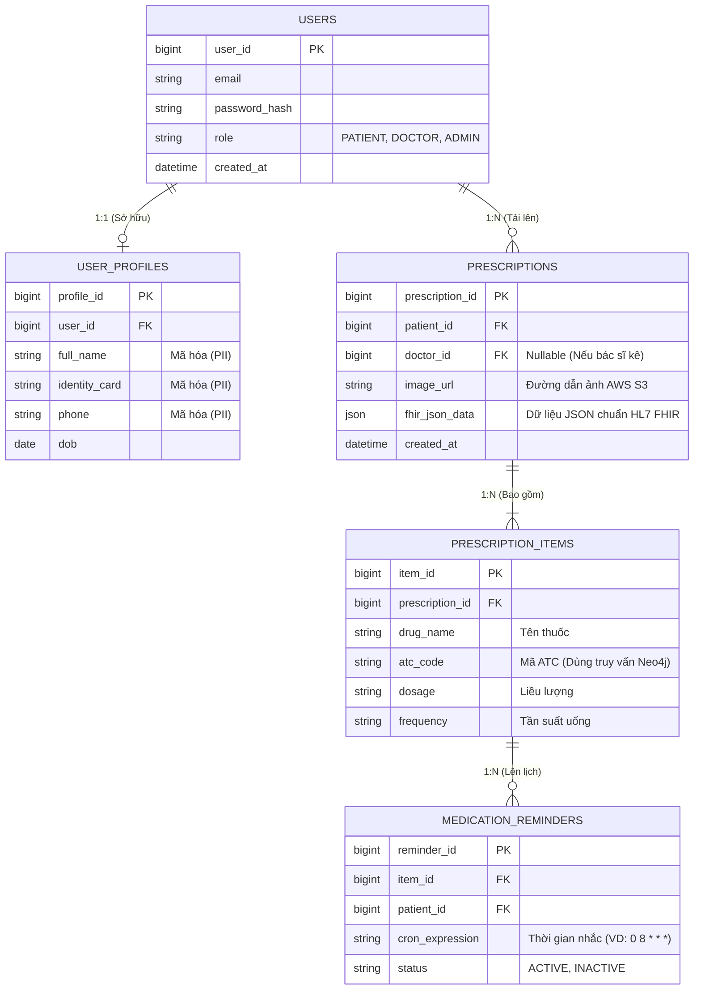
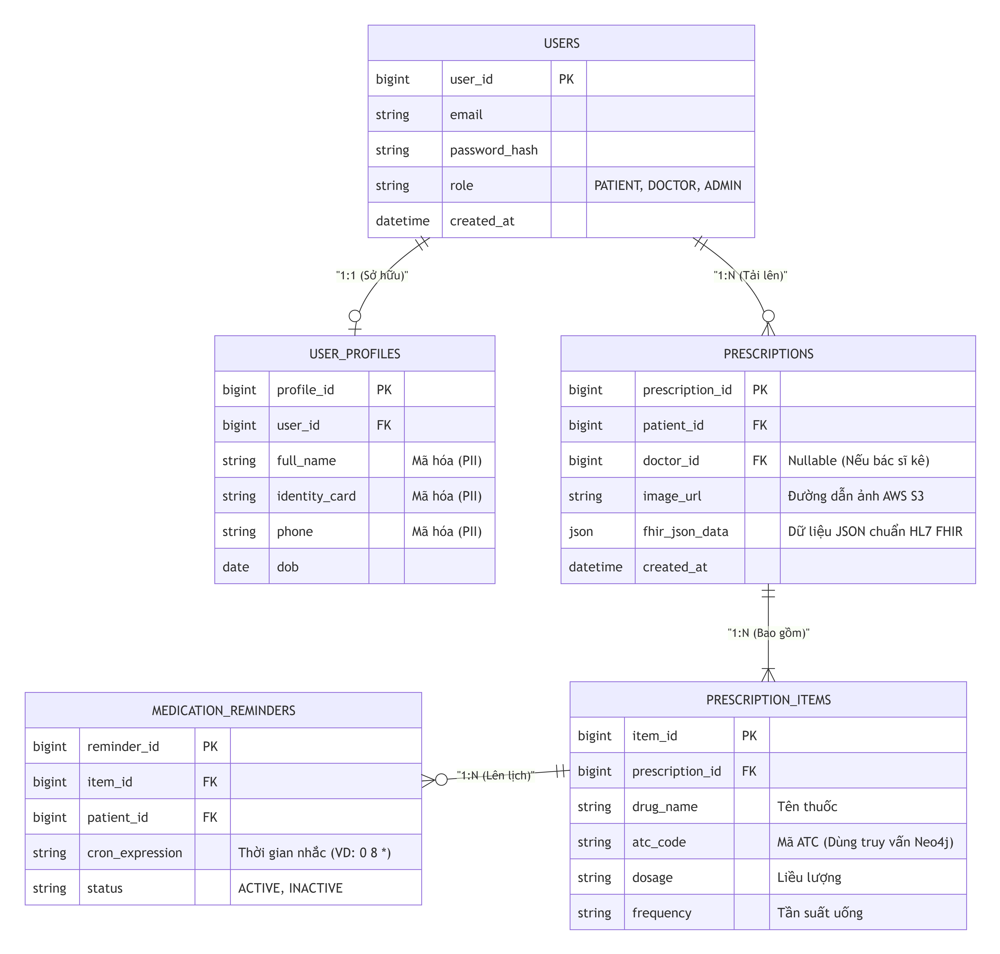
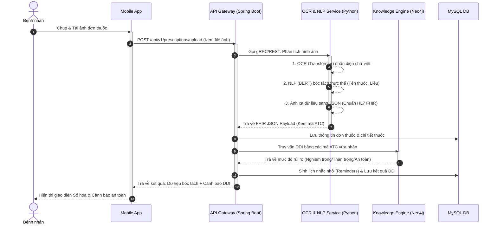
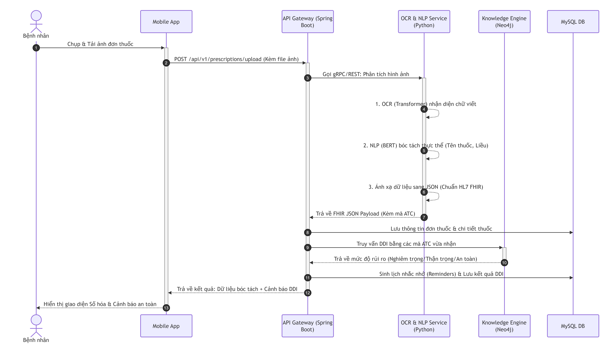
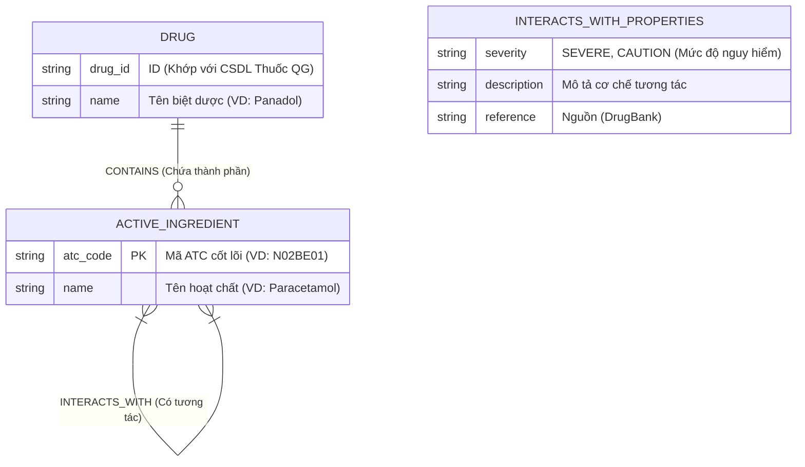

# 📐 Biểu đồ Hệ thống - MediScan AI

Tài liệu này chứa các bản nháp biểu đồ cốt lõi cho dự án MediScan AI, được thiết kế bằng chuẩn mã nguồn **Mermaid**. 

> [!TIP]
> Bạn có thể xem trực tiếp các biểu đồ này bằng cách copy mã nguồn bên dưới (phần nằm trong block `mermaid`) và dán vào [Mermaid Live Editor](https://mermaid.live/), hoặc cài đặt extension hỗ trợ Mermaid (ví dụ: Markdown Preview Mermaid Support) ngay trên VS Code / GitHub.

---

## 1. Biểu đồ Use Case (Tổng quan tính năng)

Thể hiện các tác nhân (Actors) và các hành động chính mà họ có thể thực hiện trong hệ thống.



---

## 2. Biểu đồ ERD (Mô hình Dữ liệu Quan hệ - RDS)

Thiết kế cơ sở dữ liệu cơ bản cho **MySQL**.
> [!IMPORTANT]
> - Bảng `USER_PROFILES` được tách riêng để mã hóa chuẩn AES (chuẩn hóa PII).
> - Trường `atc_code` trong bảng `PRESCRIPTION_ITEMS` chính là "chìa khóa" (tham chiếu logic) để Backend dùng đi query tiếp sang CSDL Đồ thị **Neo4j** nhằm tìm tương tác thuốc.
> - Bảng `PRESCRIPTIONS` có một cột `fhir_json_data` để lưu trữ dạng thô chuẩn Y tế Quốc tế.




## 3. Biểu đồ Tuần tự (Sequence Diagram) - Luồng cốt lõi

Biểu diễn luồng xử lý phức tạp nhất: **Bệnh nhân tải đơn thuốc -> Nhận diện OCR -> Kiểm tra tương tác (DDI) -> Trả về kết quả.**




---

## 4. Mô hình Dữ liệu Đồ thị (Neo4j Graph Schema)

Biểu đồ này mô tả cấu trúc dữ liệu lưu trong **Neo4j** để phục vụ việc truy vấn nhanh tương tác thuốc (Drug-Drug Interaction - DDI).
- **Node (Thực thể):** `Drug` (Thuốc), `ActiveIngredient` (Hoạt chất).
- **Relationship (Mối quan hệ):** `CONTAINS` (Chứa thành phần), `INTERACTS_WITH` (Tương tác với).
- Cấu trúc này giúp Backend truy vấn cực nhanh: *"Tìm tất cả tương tác giữa các hoạt chất của thuốc A với thuốc B"*.



---

## 5. Kiến trúc Hệ thống Tổng thể (System / Deployment Architecture)

Sơ đồ mô tả kiến trúc **Microservices** tổng thể, thể hiện rõ cách Spring Boot (Backend) và Python (AI OCR) phối hợp với các cơ sở dữ liệu (MySQL, Neo4j, S3).

```mermaid
flowchart TD
    %% Khối Client
    subgraph Client_Tier [Client / Frontend]
        App[Mobile App]
        Web[Web Portal cho Bác sĩ]
    end
    
    %% Gateway
    subgraph Gateway_Tier [API Gateway]
        AG[Spring Cloud Gateway + JWT Auth]
    end
    
    %% Khối Microservices (Java Spring Boot)
    subgraph Backend_Tier [Core Microservices - Spring Boot]
        UserSvc[User & Auth Service]
        PrescriptionSvc[Prescription & DDI Service]
        NotifSvc[Notification / WebSocket Service]
    end
    
    %% Khối AI (Python)
    subgraph AI_Tier [AI Services - Python]
        OCR[OCR & NLP Engine (FastAPI)]
        RAG[RAG Consulting Engine]
    end
    
    %% Khối Database & Storage
    subgraph Data_Tier [Polyglot Persistence Layer]
        MySQL[(MySQL - Hồ sơ, Lịch nhắc)]
        Neo4j[(Neo4j - Đồ thị tương tác thuốc)]
        Redis[(Redis - Message Broker / Cache)]
        S3[(AWS S3 - Lưu ảnh đơn thuốc)]
    end

    %% Routing
    Client_Tier -->|REST / HTTPS| AG
    AG --> UserSvc
    AG --> PrescriptionSvc
    
    %% Spring Boot giao tiếp DB
    UserSvc --> MySQL
    PrescriptionSvc --> MySQL
    PrescriptionSvc -->|Truy vấn Cypher| Neo4j
    PrescriptionSvc -->|Upload File| S3
    
    %% Spring Boot gọi Python
    PrescriptionSvc <-->|REST API / gRPC| OCR
    PrescriptionSvc <-->|Tư vấn an toàn| RAG
    
    %% AI Query
    RAG -.->|Chống ảo giác (RAG)| Neo4j
    
    %% Event & Notification
    PrescriptionSvc -->|Publish Event nhắc thuốc| Redis
    Redis -->|Consume Event| NotifSvc
    NotifSvc -->|WebSocket / Push Notif| App
```