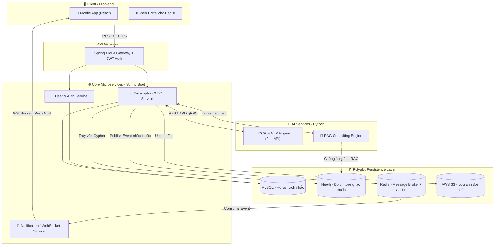
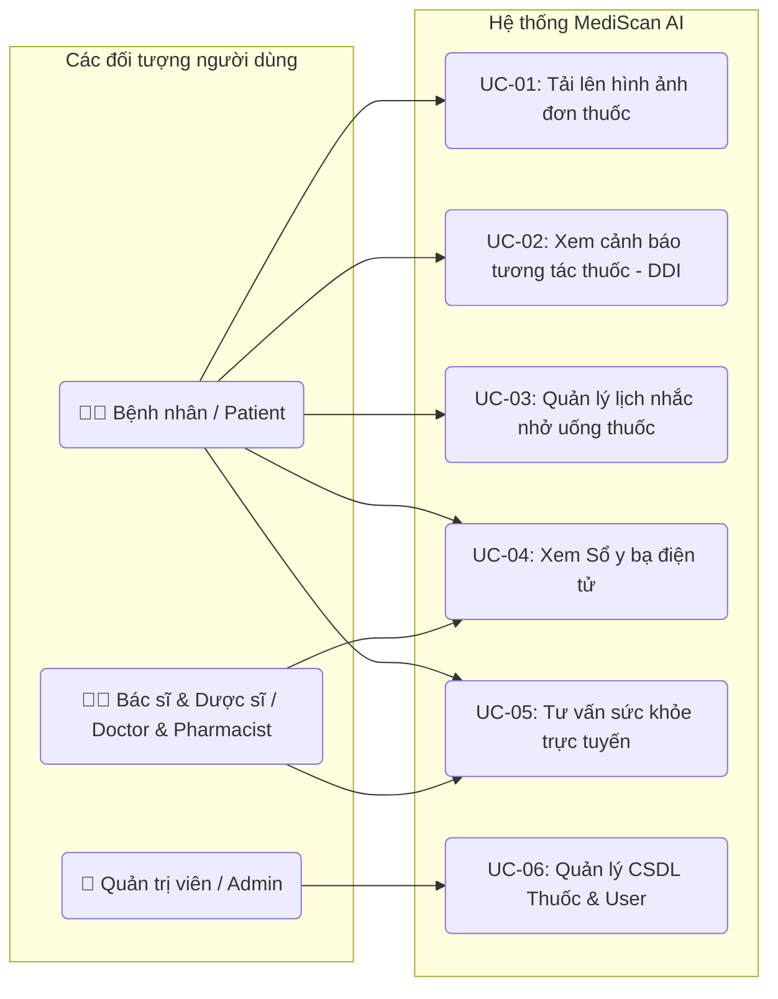
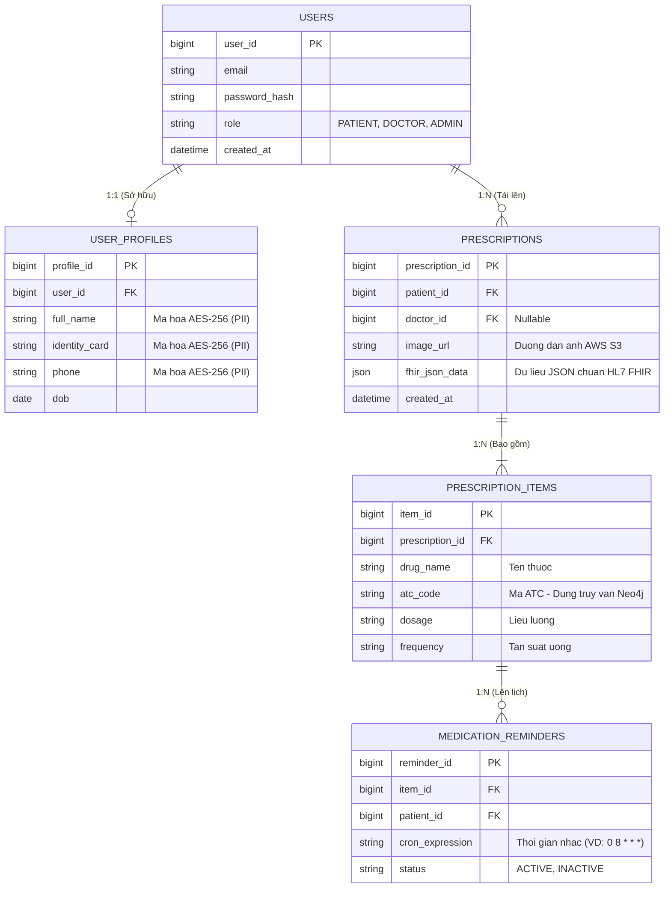
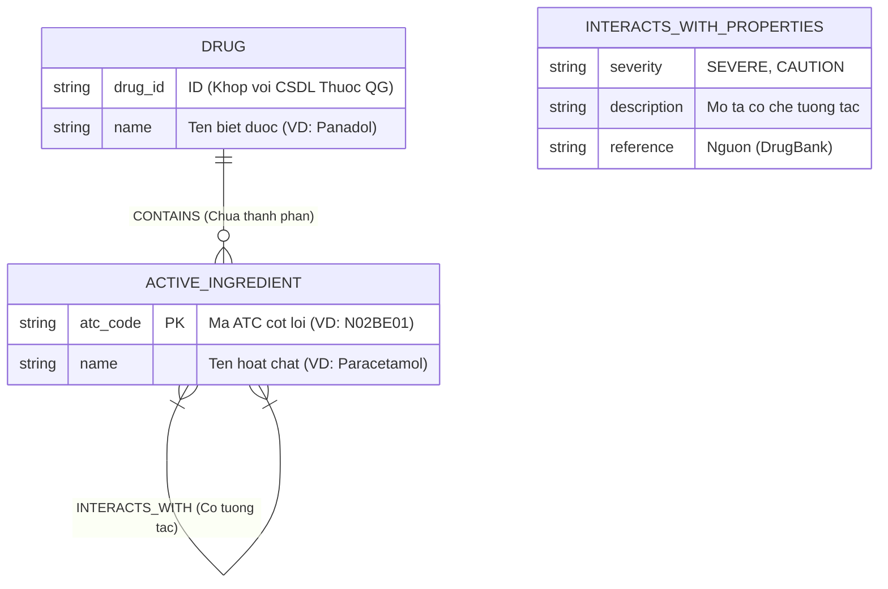
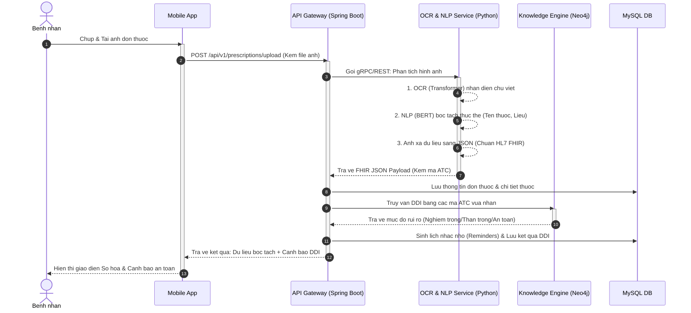

<div align="center">

# 📋 REQUIREMENT & DESIGN SPECIFICATION (RDS)

## MediScan AI – Medical Record Digitization & Drug Interaction Warning

**Hệ thống Số hóa Hồ sơ Y tế & Cảnh báo Tương tác Thuốc bằng AI**

---

| Thông tin | Chi tiết |
|:---|:---|
| **Mã dự án** | SWD391 - Group 1 |
| **Phiên bản** | v2.0 |
| **Ngày tạo** | 10/07/2026 |
| **Trạng thái** | Draft |

</div>

---

## 📑 Lịch sử Chỉnh sửa (Revision History)

| Phiên bản | Ngày | Mô tả thay đổi | Tác giả |
|:---:|:---:|:---|:---|
| 1.0 | - | Bản thảo đầu tiên (Requirement & Design Specification) | Group 1 |
| 2.0 | 10/07/2026 | Tài liệu RDS đầy đủ: Bổ sung toàn bộ Functional Requirements, Non-Functional Requirements, Business Rules, Database Design, API Specification, UI/UX Requirements, Glossary | Group 1 |

---

## 📖 MỤC LỤC (Table of Contents)

1. [Giới thiệu (Introduction)](#1-giới-thiệu-introduction)
2. [Mô tả Tổng quan (Overall Description)](#2-mô-tả-tổng-quan-overall-description)
3. [Kiến trúc Hệ thống (System Architecture)](#3-kiến-trúc-hệ-thống-system-architecture)
4. [Yêu cầu Chức năng (Functional Requirements)](#4-yêu-cầu-chức-năng-functional-requirements)
5. [Yêu cầu Phi chức năng (Non-Functional Requirements)](#5-yêu-cầu-phi-chức-năng-non-functional-requirements)
6. [Quy tắc Nghiệp vụ (Business Rules)](#6-quy-tắc-nghiệp-vụ-business-rules)
7. [Biểu đồ Use Case (Use Case Diagrams)](#7-biểu-đồ-use-case-use-case-diagrams)
8. [Thiết kế Cơ sở Dữ liệu (Database Design)](#8-thiết-kế-cơ-sở-dữ-liệu-database-design)
9. [Biểu đồ Tuần tự (Sequence Diagrams)](#9-biểu-đồ-tuần-tự-sequence-diagrams)
10. [Đặc tả API (API Specification)](#10-đặc-tả-api-api-specification)
11. [Yêu cầu Giao diện (UI/UX Requirements)](#11-yêu-cầu-giao-diện-uiux-requirements)
12. [Bảng Thuật ngữ (Glossary)](#12-bảng-thuật-ngữ-glossary)

---

# 1. Giới thiệu (Introduction)

## 1.1 Mục đích tài liệu (Purpose)

Tài liệu **Requirement & Design Specification (RDS)** này nhằm mục đích:
- Định nghĩa đầy đủ và chi tiết các yêu cầu chức năng (Functional Requirements) và phi chức năng (Non-Functional Requirements) của hệ thống **MediScan AI**.
- Mô tả kiến trúc hệ thống, thiết kế cơ sở dữ liệu, đặc tả API, và các quy tắc nghiệp vụ cốt lõi.
- Làm tài liệu tham chiếu chính cho đội ngũ phát triển (Development Team), kiểm thử (QA/QC), và các bên liên quan (Stakeholders) trong suốt vòng đời dự án.
- Đảm bảo sự thống nhất giữa yêu cầu của khách hàng và sản phẩm cuối cùng được xây dựng.

## 1.2 Phạm vi dự án (Scope)

**MediScan AI** là một hệ thống hỗ trợ y tế thông minh, tập trung vào hai giá trị cốt lõi:

1.  **Số hóa Đơn thuốc (Prescription Digitization):** Sử dụng công nghệ AI (OCR, NLP) để nhận diện và trích xuất thông tin từ hình ảnh đơn thuốc viết tay hoặc bản in, sau đó chuẩn hóa dữ liệu theo tiêu chuẩn y tế quốc tế **HL7 FHIR**.
2.  **Cảnh báo Tương tác Thuốc (Drug-Drug Interaction Warning - DDI):** Tự động phân tích và cảnh báo các rủi ro tương tác thuốc dựa trên cơ sở dữ liệu đồ thị **Neo4j**, giúp người dùng tránh được các phản ứng thuốc nguy hiểm.

**Trong phạm vi (In-Scope):**
- Ứng dụng di động (Mobile App) cho bệnh nhân.
- Cổng thông tin Web (Web Portal) cho bác sĩ và quản trị viên.
- Dịch vụ OCR & NLP bóc tách thông tin đơn thuốc.
- Hệ thống cảnh báo tương tác thuốc 3 cấp độ.
- Sổ y bạ điện tử (Digital Health Log).
- Hệ thống nhắc nhở uống thuốc (Medication Reminders).
- Quản lý người dùng và phân quyền (3 vai trò).

**Ngoài phạm vi (Out-of-Scope) - Phát triển trong tương lai (Roadmap):**
- Tư vấn dược sĩ trực tuyến qua Video Call (Giai đoạn 4).
- Tích hợp API với các chuỗi nhà thuốc lớn (Giai đoạn 3).

## 1.3 Định nghĩa & Viết tắt (Definitions & Acronyms)

| Viết tắt | Định nghĩa đầy đủ | Mô tả |
|:---|:---|:---|
| **OCR** | Optical Character Recognition | Nhận dạng ký tự quang học – công nghệ chuyển đổi hình ảnh chữ viết thành văn bản số |
| **NLP** | Natural Language Processing | Xử lý Ngôn ngữ Tự nhiên |
| **NER** | Named Entity Recognition | Nhận diện Thực thể Có tên – kỹ thuật NLP bóc tách các thực thể (tên thuốc, liều lượng) |
| **DDI** | Drug-Drug Interaction | Tương tác Thuốc-Thuốc – phản ứng không mong muốn khi dùng chung 2+ loại thuốc |
| **HL7 FHIR** | Health Level 7 – Fast Healthcare Interoperability Resources | Tiêu chuẩn dữ liệu Y tế Quốc tế để trao đổi thông tin sức khỏe điện tử |
| **ATC** | Anatomical Therapeutic Chemical Classification System | Hệ thống phân loại thuốc theo Giải phẫu – Điều trị – Hóa học (WHO) |
| **RAG** | Retrieval-Augmented Generation | Sinh câu trả lời có truy xuất dữ liệu – kỹ thuật AI chống ảo tưởng (hallucination) |
| **PII** | Personally Identifiable Information | Thông tin Định danh Cá nhân (Tên, SĐT, CCCD) |
| **LLM** | Large Language Model | Mô hình Ngôn ngữ Lớn (GPT, BERT, ...) |
| **JWT** | JSON Web Token | Token xác thực dạng JSON |
| **gRPC** | Google Remote Procedure Call | Giao thức gọi hàm từ xa hiệu năng cao của Google |
| **MVP** | Minimum Viable Product | Sản phẩm khả dụng tối thiểu |

## 1.4 Tài liệu Tham chiếu (References)

| # | Tài liệu | Mô tả |
|:---:|:---|:---|
| 1 | Nghị định 117/2020/NĐ-CP | Quy định về xử phạt hành chính trong lĩnh vực y tế (liên quan đến hồ sơ bệnh án, kê đơn thuốc) |
| 2 | HL7 FHIR R4 Specification | Tiêu chuẩn dữ liệu y tế quốc tế (https://hl7.org/fhir/) |
| 3 | WHO ATC/DDD Index | Hệ thống phân loại thuốc của Tổ chức Y tế Thế giới |
| 4 | DrugBank Database | Cơ sở dữ liệu thuốc quốc tế (https://go.drugbank.com/) |
| 5 | IEEE 830-1998 (SRS Standard) | Tiêu chuẩn IEEE cho đặc tả yêu cầu phần mềm |

---

# 2. Mô tả Tổng quan (Overall Description)

## 2.1 Bối cảnh sản phẩm (Product Perspective)

Trong bối cảnh ngành y tế Việt Nam, việc bác sĩ kê đơn thuốc viết tay vẫn còn phổ biến, dẫn đến nhiều rủi ro:
- **Đọc sai liều lượng** do chữ viết tay không rõ ràng.
- **Không kiểm soát được tương tác thuốc** giữa các chuyên khoa khác nhau khi bệnh nhân khám nhiều nơi.
- **Khó truy xuất lịch sử bệnh án** khi cần thiết.

**MediScan AI** ra đời như một giải pháp hỗ trợ bệnh nhân và phòng khám tuân thủ **Nghị định 117/2020/NĐ-CP**, biến áp lực pháp lý thành công cụ bảo vệ sức khỏe người dùng.

Hệ thống hoạt động như một **ứng dụng độc lập (Standalone Application)** với kiến trúc **Microservices**, không phụ thuộc vào hệ thống bệnh viện hiện có, nhưng có khả năng tích hợp trong tương lai thông qua chuẩn HL7 FHIR.

## 2.2 Tính năng sản phẩm (Product Functions)

| # | Tính năng | Mô tả ngắn |
|:---:|:---|:---|
| F1 | **OCR Intelligent Scanning** | Nhận diện chữ viết tay từ ảnh chụp đơn thuốc với độ chính xác cao nhờ mô hình Transformer |
| F2 | **Smart DDI Alert** | Cảnh báo tương tác thuốc theo 3 cấp độ (🔴 Nghiêm trọng / 🟡 Thận trọng / 🟢 An toàn) |
| F3 | **Digital Health Log** | Lưu trữ lịch sử bệnh án trên Cloud, hỗ trợ truy xuất nhanh |
| F4 | **Medication Reminders** | Tự động thiết lập lịch nhắc uống thuốc từ dữ liệu đã số hóa |
| F5 | **User Management** | Quản lý tài khoản, phân quyền (Patient / Doctor / Admin) |
| F6 | **RAG Consulting** | Tư vấn y khoa an toàn bằng AI (chống ảo tưởng - Hallucination) |

## 2.3 Đối tượng Người dùng (User Classes & Characteristics)

| Vai trò | Mô tả | Quyền hạn chính |
|:---|:---|:---|
| **Bệnh nhân (Patient)** | Người dùng chính của hệ thống. Sử dụng Mobile App để quản lý sức khỏe cá nhân. | Tải lên đơn thuốc, xem cảnh báo DDI, quản lý lịch nhắc nhở, xem sổ y bạ điện tử, nhận tư vấn AI |
| **Bác sĩ / Dược sĩ (Doctor / Pharmacist)** | Chuyên gia y tế đã được xác minh chứng chỉ hành nghề. Sử dụng Web Portal. | Xem hồ sơ bệnh nhân (khi được cấp quyền), tư vấn trực tuyến (Giai đoạn 4) |
| **Quản trị viên (Admin)** | Quản lý toàn bộ hệ thống. | Quản lý tài khoản người dùng, cấu hình hệ thống, quản lý CSDL thuốc |

## 2.4 Môi trường Vận hành (Operating Environment)

| Thành phần | Yêu cầu |
|:---|:---|
| **Client - Mobile** | Android 10+ / iOS 14+ (React Native hoặc tương đương) |
| **Client - Web** | Trình duyệt hiện đại (Chrome 90+, Firefox 88+, Safari 14+, Edge 90+) |
| **Server - Backend** | Java 17+, Spring Boot 3.x, chạy trên Docker Container |
| **Server - AI** | Python 3.10+, FastAPI, TensorFlow/PyTorch |
| **Database** | MySQL 8.0+ (Relational), Neo4j 5.x (Graph) |
| **Cloud** | AWS (EC2, S3, RDS, hoặc tương đương) |
| **Cache/Broker** | Redis 7.x |

## 2.5 Ràng buộc & Giả định (Constraints & Assumptions)

### Ràng buộc (Constraints)
- Tuân thủ **Nghị định 117/2020/NĐ-CP** về lưu trữ hồ sơ bệnh án.
- Dữ liệu PII phải được mã hóa **AES-256** khi lưu trữ.
- Truyền tải dữ liệu phải qua **SSL/TLS**.
- Đội ngũ phát triển gồm **3 kỹ sư phần mềm**.
- AI tư vấn y khoa **bắt buộc** sử dụng kiến trúc **RAG** (không được tự do sinh text về liều lượng thuốc).

### Giả định (Assumptions)
- Người dùng có smartphone với camera có chất lượng tối thiểu 8MP.
- Đơn thuốc viết tay sử dụng tiếng Việt hoặc thuật ngữ y tế Latinh phổ thông.
- Cơ sở dữ liệu DrugBank Quốc gia có API hoặc dữ liệu xuất có thể import.
- Hệ thống internet ổn định cho các tính năng Cloud.

---

# 3. Kiến trúc Hệ thống (System Architecture)

## 3.1 Tổng quan Kiến trúc (Architecture Overview)

Hệ thống **MediScan AI** được thiết kế theo kiến trúc **Microservices**, tuân thủ nguyên lý **SOLID** và **Clean Architecture**, bao gồm 5 tầng chính:



## 3.2 Công nghệ Sử dụng (Technology Stack)

| Tầng (Layer) | Công nghệ (Technology) | Mục đích |
|:---|:---|:---|
| **Frontend** | React, Vite, Tailwind CSS, Redux Toolkit | Xây dựng giao diện người dùng (Mobile App & Web Portal) |
| **Backend** | Java Spring Boot, Hibernate, Spring Security | API Gateway, xử lý nghiệp vụ, xác thực/phân quyền |
| **AI/ML** | Python, TensorFlow/PyTorch, Tesseract OCR, NLP (BERT) | Dịch vụ OCR nhận diện chữ viết tay, NER bóc tách thực thể y tế |
| **Database - SQL** | MySQL 8.0+ | Lưu trữ dữ liệu quan hệ (Users, Prescriptions, Reminders) |
| **Database - Graph** | Neo4j 5.x | Lưu trữ và truy vấn đồ thị tương tác thuốc (DDI Graph) |
| **Cache / Broker** | Redis 7.x | Message Broker cho sự kiện nhắc thuốc, cache hiệu năng |
| **Storage** | AWS S3 | Lưu trữ hình ảnh đơn thuốc gốc |
| **DevOps** | Docker, AWS, GitHub Actions (CI/CD) | Container hóa, triển khai, tích hợp liên tục |

## 3.3 Mô tả Chi tiết Các Microservice

### 3.3.1 User & Auth Service
- **Chức năng:** Quản lý đăng ký, đăng nhập, xác thực JWT, phân quyền RBAC.
- **Database:** MySQL (bảng `USERS`, `USER_PROFILES`).
- **Giao tiếp:** REST API qua API Gateway.

### 3.3.2 Prescription & DDI Service
- **Chức năng:** Xử lý luồng cốt lõi – nhận ảnh đơn thuốc → gọi OCR Service → lưu trữ dữ liệu → truy vấn DDI → trả kết quả.
- **Database:** MySQL (bảng `PRESCRIPTIONS`, `PRESCRIPTION_ITEMS`), Neo4j (truy vấn DDI), AWS S3 (lưu ảnh).
- **Giao tiếp:** REST/gRPC tới OCR & NLP Service (Python), Publish event tới Redis.

### 3.3.3 Notification / WebSocket Service
- **Chức năng:** Quản lý thông báo đẩy, nhắc lịch uống thuốc theo thời gian thực.
- **Database:** MySQL (bảng `MEDICATION_REMINDERS`).
- **Giao tiếp:** Consume event từ Redis, WebSocket/Push Notification tới Client.

### 3.3.4 OCR & NLP Engine (Python - FastAPI)
- **Chức năng:** Nhận ảnh đơn thuốc → OCR (Transformer) nhận diện chữ viết → NLP (BERT) bóc tách thực thể (NER) → Ánh xạ sang JSON chuẩn HL7 FHIR → Trả về payload kèm mã ATC.
- **Giao tiếp:** Nhận request từ Prescription Service qua REST/gRPC.

### 3.3.5 RAG Consulting Engine (Python)
- **Chức năng:** Tư vấn y khoa an toàn sử dụng kiến trúc RAG, chỉ truy vấn trong vùng dữ liệu đã xác thực, tuyệt đối không tự do suy luận về liều lượng thuốc.
- **Database:** Truy vấn Neo4j (DDI Graph) làm nguồn dữ liệu tin cậy.

---

# 4. Yêu cầu Chức năng (Functional Requirements)

## 4.1 Mô-đun Quản lý Người dùng (User Management Module)

### FR-UM-01: Đăng ký Tài khoản
| Thuộc tính | Chi tiết |
|:---|:---|
| **Mã yêu cầu** | FR-UM-01 |
| **Tên** | Đăng ký Tài khoản (User Registration) |
| **Mô tả** | Hệ thống cho phép người dùng mới đăng ký tài khoản bằng email và mật khẩu. |
| **Tác nhân** | Bệnh nhân, Bác sĩ/Dược sĩ |
| **Điều kiện trước** | Người dùng chưa có tài khoản trong hệ thống. |
| **Luồng chính** | 1. Người dùng mở màn hình Đăng ký.<br>2. Nhập email, mật khẩu, xác nhận mật khẩu.<br>3. Hệ thống kiểm tra tính hợp lệ (email unique, password policy).<br>4. Hệ thống tạo tài khoản với vai trò mặc định là **PATIENT**.<br>5. Gửi email xác minh (verification). |
| **Luồng thay thế** | Email đã tồn tại → Thông báo lỗi. Password không đủ mạnh → Yêu cầu nhập lại. |
| **Điều kiện sau** | Tài khoản được tạo thành công, người dùng được chuyển sang màn hình Đăng nhập. |
| **Độ ưu tiên** | Cao (High) |

### FR-UM-02: Đăng nhập
| Thuộc tính | Chi tiết |
|:---|:---|
| **Mã yêu cầu** | FR-UM-02 |
| **Tên** | Đăng nhập (User Login) |
| **Mô tả** | Hệ thống cho phép người dùng đăng nhập bằng email và mật khẩu. |
| **Tác nhân** | Bệnh nhân, Bác sĩ/Dược sĩ, Admin |
| **Điều kiện trước** | Người dùng đã có tài khoản hợp lệ. |
| **Luồng chính** | 1. Người dùng nhập email và mật khẩu.<br>2. Hệ thống xác thực thông tin.<br>3. Tạo JWT token (Access + Refresh).<br>4. Chuyển hướng về màn hình chính tương ứng với vai trò. |
| **Luồng thay thế** | Sai thông tin → Thông báo lỗi. Vượt quá 5 lần thử → Khóa tạm thời. |
| **Điều kiện sau** | Người dùng được xác thực thành công, JWT token được lưu trên client. |
| **Độ ưu tiên** | Cao (High) |

### FR-UM-03: Quản lý Hồ sơ Cá nhân
| Thuộc tính | Chi tiết |
|:---|:---|
| **Mã yêu cầu** | FR-UM-03 |
| **Tên** | Quản lý Hồ sơ Cá nhân (Profile Management) |
| **Mô tả** | Người dùng có thể xem và chỉnh sửa thông tin cá nhân (họ tên, SĐT, CCCD, ngày sinh). |
| **Tác nhân** | Bệnh nhân, Bác sĩ/Dược sĩ |
| **Điều kiện trước** | Người dùng đã đăng nhập thành công. |
| **Luồng chính** | 1. Người dùng mở trang Hồ sơ cá nhân.<br>2. Xem thông tin hiện tại.<br>3. Chỉnh sửa các trường thông tin (full_name, phone, identity_card, dob).<br>4. Bấm Lưu → Hệ thống cập nhật và mã hóa AES-256 cho các trường PII. |
| **Điều kiện sau** | Thông tin cá nhân được cập nhật thành công. |
| **Độ ưu tiên** | Trung bình (Medium) |

### FR-UM-04: Phân quyền theo Vai trò (RBAC)
| Thuộc tính | Chi tiết |
|:---|:---|
| **Mã yêu cầu** | FR-UM-04 |
| **Tên** | Phân quyền theo Vai trò (Role-Based Access Control) |
| **Mô tả** | Hệ thống phân định quyền truy cập dựa trên 3 vai trò: PATIENT, DOCTOR, ADMIN. |
| **Tác nhân** | Tất cả |
| **Chi tiết phân quyền** | Xem bảng **User Classes** tại Mục 2.3. |
| **Độ ưu tiên** | Cao (High) |

### FR-UM-05: Xác minh Chứng chỉ Hành nghề (Bác sĩ/Dược sĩ)
| Thuộc tính | Chi tiết |
|:---|:---|
| **Mã yêu cầu** | FR-UM-05 |
| **Tên** | Xác minh Chứng chỉ Hành nghề |
| **Mô tả** | Bác sĩ/Dược sĩ phải trải qua quy trình xác minh chứng chỉ hành nghề hợp lệ trước khi được cấp quyền tư vấn. |
| **Tác nhân** | Bác sĩ/Dược sĩ, Admin |
| **Luồng chính** | 1. Bác sĩ/Dược sĩ đăng ký tài khoản.<br>2. Upload ảnh chứng chỉ hành nghề.<br>3. Admin xem xét và xác minh.<br>4. Admin phê duyệt → Nâng vai trò lên DOCTOR. |
| **Độ ưu tiên** | Thấp (Low) – Áp dụng cho Giai đoạn 4 (Roadmap) |

---

## 4.2 Mô-đun Số hóa Đơn thuốc (Prescription Digitization Module)

### FR-PR-01: Tải lên Hình ảnh Đơn thuốc
| Thuộc tính | Chi tiết |
|:---|:---|
| **Mã yêu cầu** | FR-PR-01 |
| **Tên** | Tải lên Hình ảnh Đơn thuốc (Upload Prescription Image) |
| **Mô tả** | Hệ thống cho phép người dùng tải lên hình ảnh đơn thuốc (viết tay hoặc bản in) từ Camera hoặc Thư viện ảnh. |
| **Tác nhân** | Bệnh nhân |
| **Điều kiện trước** | Người dùng đã đăng nhập. |
| **Luồng chính** | 1. Bệnh nhân chọn "Quét đơn thuốc".<br>2. Chọn nguồn ảnh: Camera (chụp trực tiếp) hoặc Thư viện.<br>3. Ảnh được tải lên AWS S3.<br>4. Hệ thống trả về xác nhận upload thành công và bắt đầu xử lý OCR. |
| **Yêu cầu kỹ thuật** | Format: JPEG/PNG. Kích thước tối đa: 10MB. Độ phân giải tối thiểu: 720p. |
| **Liên kết BR** | BR-PR-01 |
| **Độ ưu tiên** | Cao (High) |

### FR-PR-02: Nhận diện OCR & Bóc tách Thông tin
| Thuộc tính | Chi tiết |
|:---|:---|
| **Mã yêu cầu** | FR-PR-02 |
| **Tên** | Nhận diện OCR & Bóc tách Thông tin (OCR Recognition & Data Extraction) |
| **Mô tả** | Hệ thống AI phải nhận diện chữ viết tay từ hình ảnh đơn thuốc và bóc tách thành công các trường thông tin y tế quan trọng. |
| **Tác nhân** | Hệ thống (Tự động) |
| **Điều kiện trước** | Hình ảnh đơn thuốc đã upload thành công (FR-PR-01). |
| **Luồng chính** | 1. OCR Service (Transformer) nhận ảnh và nhận diện chữ viết.<br>2. NLP Service (BERT) thực hiện NER bóc tách thực thể.<br>3. Trích xuất các trường: **Tên thuốc, Thành phần hoạt chất, Liều lượng, Cách dùng/Tần suất**.<br>4. Trả về kết quả bóc tách cho Backend. |
| **Luồng thay thế** | Ảnh mờ/không đọc được → Thông báo yêu cầu chụp lại. Kết quả OCR confidence thấp → Yêu cầu người dùng xác nhận/chỉnh sửa thủ công. |
| **Liên kết BR** | BR-PR-02 |
| **Độ ưu tiên** | Cao (High) |

### FR-PR-03: Chuẩn hóa Dữ liệu theo HL7 FHIR
| Thuộc tính | Chi tiết |
|:---|:---|
| **Mã yêu cầu** | FR-PR-03 |
| **Tên** | Chuẩn hóa Dữ liệu theo HL7 FHIR |
| **Mô tả** | Mọi dữ liệu phi cấu trúc bóc tách từ ảnh chụp đơn thuốc phải được ánh xạ (mapping) thành định dạng JSON tuân thủ nghiêm ngặt tiêu chuẩn HL7 FHIR trước khi lưu trữ. |
| **Tác nhân** | Hệ thống (Tự động) |
| **Điều kiện trước** | Dữ liệu đã bóc tách thành công (FR-PR-02). |
| **Luồng chính** | 1. OCR Service nhận dữ liệu bóc tách thô.<br>2. Ánh xạ sang cấu trúc FHIR Resource (MedicationRequest, Patient).<br>3. Tạo JSON payload tuân thủ HL7 FHIR R4.<br>4. Gắn mã ATC cho mỗi hoạt chất.<br>5. Trả về FHIR JSON Payload kèm mã ATC cho Backend. |
| **Output mẫu** | `fhir_json_data` được lưu vào cột tương ứng trong bảng `PRESCRIPTIONS`. |
| **Liên kết BR** | BR-PR-03 |
| **Độ ưu tiên** | Cao (High) |

### FR-PR-04: Lưu trữ Đơn thuốc vào Sổ Y bạ Điện tử
| Thuộc tính | Chi tiết |
|:---|:---|
| **Mã yêu cầu** | FR-PR-04 |
| **Tên** | Lưu trữ Đơn thuốc (Save to Digital Health Log) |
| **Mô tả** | Đơn thuốc sau khi số hóa thành công phải được lưu tự động vào "Sổ y bạ điện tử" (Digital Health Log) của người dùng trên Cloud. |
| **Tác nhân** | Hệ thống (Tự động) |
| **Điều kiện trước** | Dữ liệu đã chuẩn hóa FHIR (FR-PR-03). |
| **Luồng chính** | 1. Backend lưu thông tin đơn thuốc vào bảng `PRESCRIPTIONS`.<br>2. Lưu chi tiết từng loại thuốc vào bảng `PRESCRIPTION_ITEMS`.<br>3. Lưu URL ảnh gốc (AWS S3) vào trường `image_url`.<br>4. Lưu dữ liệu FHIR JSON vào trường `fhir_json_data`. |
| **Liên kết BR** | BR-PR-04 |
| **Độ ưu tiên** | Cao (High) |

### FR-PR-05: Xem Sổ Y bạ Điện tử (Digital Health Log)
| Thuộc tính | Chi tiết |
|:---|:---|
| **Mã yêu cầu** | FR-PR-05 |
| **Tên** | Xem Sổ Y bạ Điện tử |
| **Mô tả** | Người dùng có thể xem toàn bộ lịch sử đơn thuốc đã số hóa, sắp xếp theo thời gian, cho phép truy xuất nhanh khi cần. |
| **Tác nhân** | Bệnh nhân, Bác sĩ/Dược sĩ (khi được cấp quyền) |
| **Luồng chính** | 1. Người dùng mở trang "Sổ y bạ".<br>2. Hệ thống hiển thị danh sách đơn thuốc theo timeline (mới nhất trước).<br>3. Mỗi item hiển thị: Ngày tạo, số loại thuốc, trạng thái DDI.<br>4. Bấm vào item → Xem chi tiết: Ảnh gốc, danh sách thuốc bóc tách, kết quả DDI. |
| **Độ ưu tiên** | Cao (High) |

---

## 4.3 Mô-đun Cảnh báo Tương tác Thuốc (DDI Alert Module)

### FR-DDI-01: Trích xuất Mã ATC
| Thuộc tính | Chi tiết |
|:---|:---|
| **Mã yêu cầu** | FR-DDI-01 |
| **Tên** | Trích xuất Mã ATC (ATC Code Extraction) |
| **Mô tả** | Với mỗi loại thuốc được thêm vào hệ thống (qua quét đơn hoặc nhập tay), hệ thống phải tự động trích xuất mã ATC của thuốc đó. |
| **Tác nhân** | Hệ thống (Tự động) |
| **Điều kiện trước** | Tên thuốc / hoạt chất đã được bóc tách thành công. |
| **Luồng chính** | 1. NLP Service nhận tên thuốc/hoạt chất.<br>2. Tra cứu trong CSDL thuốc → Ánh xạ với mã ATC tương ứng.<br>3. Lưu mã ATC vào trường `atc_code` trong bảng `PRESCRIPTION_ITEMS`. |
| **Liên kết BR** | BR-DDI-01 |
| **Độ ưu tiên** | Cao (High) |

### FR-DDI-02: Đối chiếu Tương tác Chéo (Cross-Check DDI)
| Thuộc tính | Chi tiết |
|:---|:---|
| **Mã yêu cầu** | FR-DDI-02 |
| **Tên** | Đối chiếu Tương tác Chéo (Cross-Check DDI) |
| **Mô tả** | Hệ thống phải tự động quét và đối chiếu chéo mã ATC của thuốc mới với toàn bộ danh sách thuốc hiện có trong "Tủ thuốc số" của người dùng để tính toán ma trận rủi ro tương tác thuốc. |
| **Tác nhân** | Hệ thống (Tự động) |
| **Điều kiện trước** | Mã ATC đã được trích xuất (FR-DDI-01). |
| **Luồng chính** | 1. Backend lấy danh sách mã ATC từ đơn thuốc mới.<br>2. Lấy danh sách mã ATC hiện có trong "Tủ thuốc số" của bệnh nhân.<br>3. Gửi truy vấn Cypher tới Neo4j: Tìm tất cả mối quan hệ `INTERACTS_WITH` giữa các cặp hoạt chất.<br>4. Neo4j trả về danh sách tương tác kèm mức độ nghiêm trọng (severity). |
| **Liên kết BR** | BR-DDI-02 |
| **Độ ưu tiên** | Cao (High) |

### FR-DDI-03: Hiển thị Cảnh báo 3 Cấp độ
| Thuộc tính | Chi tiết |
|:---|:---|
| **Mã yêu cầu** | FR-DDI-03 |
| **Tên** | Hiển thị Cảnh báo DDI 3 Cấp độ |
| **Mô tả** | Kết quả phân tích tương tác thuốc phải được hiển thị rõ ràng cho người dùng theo 3 cấp độ cảnh báo. |
| **Tác nhân** | Bệnh nhân |
| **Chi tiết cấp độ** | 🔴 **SEVERE (Nghiêm trọng):** Cấm / Khuyến cáo mạnh mẽ không sử dụng chung. Hiển thị cảnh báo đỏ, có popup xác nhận.<br>🟡 **CAUTION (Thận trọng):** Có thể sử dụng nhưng cần theo dõi hoặc điều chỉnh liều. Hiển thị cảnh báo vàng.<br>🟢 **SAFE (An toàn):** Không phát hiện tương tác nguy hiểm. Hiển thị trạng thái xanh. |
| **Liên kết BR** | BR-DDI-03 |
| **Độ ưu tiên** | Cao (High) |

### FR-DDI-04: Tư vấn Y khoa bằng AI (RAG)
| Thuộc tính | Chi tiết |
|:---|:---|
| **Mã yêu cầu** | FR-DDI-04 |
| **Tên** | Tư vấn Y khoa An toàn bằng AI (RAG Consulting) |
| **Mô tả** | Hệ thống LLM tư vấn y khoa tuyệt đối không được phép tự do suy luận (sinh text) liên quan đến liều lượng hoặc loại thuốc. Bắt buộc sử dụng kiến trúc RAG. |
| **Tác nhân** | Bệnh nhân |
| **Luồng chính** | 1. Bệnh nhân gửi câu hỏi liên quan đến thuốc/sức khỏe.<br>2. RAG Engine truy xuất (Retrieve) dữ liệu từ CSDL Neo4j/DrugBank.<br>3. LLM sinh câu trả lời dựa **chỉ trên** dữ liệu truy xuất được (không tự do suy luận).<br>4. Trả về câu trả lời kèm nguồn tham chiếu (reference). |
| **Luồng thay thế** | Không tìm thấy dữ liệu liên quan → Trả lời "Không đủ thông tin để tư vấn, vui lòng liên hệ bác sĩ." |
| **Liên kết BR** | BR-DDI-05 |
| **Độ ưu tiên** | Cao (High) |

---

## 4.4 Mô-đun Nhắc nhở Uống thuốc (Medication Reminder Module)

### FR-MR-01: Tự động Sinh Lịch Nhắc nhở
| Thuộc tính | Chi tiết |
|:---|:---|
| **Mã yêu cầu** | FR-MR-01 |
| **Tên** | Tự động Sinh Lịch Nhắc nhở (Auto-Generate Medication Reminders) |
| **Mô tả** | Khi một đơn thuốc được số hóa và xác nhận thành công, hệ thống phải tự động sinh ra lịch nhắc uống thuốc dựa trên "Liều lượng" và "Cách dùng". |
| **Tác nhân** | Hệ thống (Tự động) |
| **Điều kiện trước** | Đơn thuốc đã số hóa thành công với thông tin liều lượng và tần suất. |
| **Luồng chính** | 1. Backend phân tích trường `frequency` của `PRESCRIPTION_ITEMS`.<br>2. Sinh `cron_expression` tương ứng (VD: "Ngày 3 lần" → "0 8,12,20 * * *").<br>3. Tạo bản ghi trong bảng `MEDICATION_REMINDERS` với trạng thái `ACTIVE`.<br>4. Publish event "reminder_created" tới Redis. |
| **Liên kết BR** | BR-MR-01 |
| **Độ ưu tiên** | Cao (High) |

### FR-MR-02: Tùy chỉnh Lịch Nhắc nhở
| Thuộc tính | Chi tiết |
|:---|:---|
| **Mã yêu cầu** | FR-MR-02 |
| **Tên** | Tùy chỉnh Lịch Nhắc nhở (Customize Reminders) |
| **Mô tả** | Người dùng có quyền xem, bật/tắt, hoặc chỉnh sửa lại thời gian của các lịch nhắc uống thuốc. |
| **Tác nhân** | Bệnh nhân |
| **Luồng chính** | 1. Bệnh nhân mở trang "Lịch nhắc thuốc".<br>2. Xem danh sách nhắc nhở theo từng loại thuốc.<br>3. Bật/Tắt (toggle status: ACTIVE/INACTIVE).<br>4. Chỉnh sửa giờ nhắc nhở → Hệ thống cập nhật `cron_expression`. |
| **Liên kết BR** | BR-MR-02 |
| **Độ ưu tiên** | Trung bình (Medium) |

### FR-MR-03: Gửi Thông báo Đẩy Thời gian Thực
| Thuộc tính | Chi tiết |
|:---|:---|
| **Mã yêu cầu** | FR-MR-03 |
| **Tên** | Gửi Thông báo Đẩy Thời gian Thực (Real-time Push Notification) |
| **Mô tả** | Hệ thống Notification Hub phải đảm bảo gửi thông báo đẩy nhắc lịch uống thuốc tới thiết bị người dùng đúng giờ. |
| **Tác nhân** | Hệ thống (Tự động) |
| **Luồng chính** | 1. Notification Service consume event từ Redis khi đến giờ nhắc.<br>2. Gửi Push Notification (Firebase Cloud Messaging) tới Mobile App.<br>3. Gửi WebSocket message tới Web Portal (nếu online).<br>4. Ghi log trạng thái gửi (thành công/thất bại). |
| **Liên kết BR** | BR-MR-03 |
| **Độ ưu tiên** | Cao (High) |

---

## 4.5 Mô-đun Quản trị (Admin Module)

### FR-AD-01: Quản lý Tài khoản Người dùng
| Thuộc tính | Chi tiết |
|:---|:---|
| **Mã yêu cầu** | FR-AD-01 |
| **Tên** | Quản lý Tài khoản Người dùng (User Account Management) |
| **Mô tả** | Admin có thể xem, tìm kiếm, khóa/mở khóa, và thay đổi vai trò tài khoản người dùng. |
| **Tác nhân** | Admin |
| **Luồng chính** | 1. Admin đăng nhập Web Portal.<br>2. Mở trang "Quản lý người dùng".<br>3. Xem danh sách tài khoản (phân trang, tìm kiếm).<br>4. Thực hiện hành động: Khóa/Mở khóa, Thay đổi vai trò, Xem chi tiết. |
| **Độ ưu tiên** | Trung bình (Medium) |

### FR-AD-02: Quản lý Cơ sở Dữ liệu Thuốc
| Thuộc tính | Chi tiết |
|:---|:---|
| **Mã yêu cầu** | FR-AD-02 |
| **Tên** | Quản lý CSDL Thuốc (Drug Database Management) |
| **Mô tả** | Admin có thể thêm, sửa, xóa thông tin thuốc và tương tác thuốc trong cả MySQL và Neo4j. |
| **Tác nhân** | Admin |
| **Luồng chính** | 1. Admin mở trang "Quản lý CSDL Thuốc".<br>2. Xem danh sách thuốc hiện có.<br>3. Thêm mới thuốc (tên, mã ATC, hoạt chất).<br>4. Cập nhật mối quan hệ tương tác thuốc (severity, description). |
| **Độ ưu tiên** | Trung bình (Medium) |

---

# 5. Yêu cầu Phi chức năng (Non-Functional Requirements)

## 5.1 Hiệu năng (Performance)

| Mã | Yêu cầu | Chỉ số |
|:---|:---|:---|
| **NFR-P-01** | Thời gian phản hồi API thông thường | ≤ 2 giây (95th percentile) |
| **NFR-P-02** | Thời gian xử lý OCR một đơn thuốc | ≤ 10 giây (từ lúc upload đến khi có kết quả) |
| **NFR-P-03** | Thời gian truy vấn DDI trên Neo4j | ≤ 1 giây cho 10 cặp tương tác |
| **NFR-P-04** | Số lượng người dùng đồng thời | ≥ 500 concurrent users |
| **NFR-P-05** | Dung lượng tải ảnh tối đa | 10 MB / file |

## 5.2 Bảo mật (Security)

| Mã | Yêu cầu | Chi tiết |
|:---|:---|:---|
| **NFR-S-01** | Mã hóa dữ liệu lưu trữ (At-rest) | Dữ liệu PII (full_name, identity_card, phone) mã hóa **AES-256** trong MySQL |
| **NFR-S-02** | Mã hóa dữ liệu truyền tải (In-transit) | Tất cả giao tiếp Client-Server qua **SSL/TLS** (HTTPS) |
| **NFR-S-03** | Vô danh hóa PII (Anonymization) | Thông tin PII tách biệt hoàn toàn với hồ sơ bệnh lý (bảng `USER_PROFILES` riêng biệt) |
| **NFR-S-04** | Xác thực & Phân quyền | **JWT** (JSON Web Token) + **Spring Security** RBAC |
| **NFR-S-05** | Chống tấn công phổ biến | SQL Injection, XSS, CSRF protection |
| **NFR-S-06** | Password Policy | Tối thiểu 8 ký tự, bao gồm chữ hoa, chữ thường, số, ký tự đặc biệt |
| **NFR-S-07** | Brute-force Protection | Khóa tạm thời sau 5 lần đăng nhập sai liên tiếp |

## 5.3 Độ tin cậy & Khả dụng (Reliability & Availability)

| Mã | Yêu cầu | Chỉ số |
|:---|:---|:---|
| **NFR-R-01** | Uptime | ≥ 99.5% (không tính bảo trì có lịch) |
| **NFR-R-02** | Sao lưu dữ liệu | Tự động backup MySQL daily, Neo4j weekly |
| **NFR-R-03** | Khả năng khôi phục | RTO ≤ 4 giờ, RPO ≤ 1 giờ |

## 5.4 Khả năng Mở rộng (Scalability)

| Mã | Yêu cầu | Chi tiết |
|:---|:---|:---|
| **NFR-SC-01** | Horizontal Scaling | Microservices có khả năng scale horizontal qua Docker + Load Balancer |
| **NFR-SC-02** | Database Scaling | MySQL Read Replica, Neo4j Causal Cluster cho high-read workload |

## 5.5 Tuân thủ Pháp lý (Compliance)

| Mã | Yêu cầu | Chi tiết |
|:---|:---|:---|
| **NFR-C-01** | Nghị định 117/2020/NĐ-CP | Đáp ứng quy định về lưu trữ hồ sơ bệnh án, kê đơn thuốc rõ ràng |
| **NFR-C-02** | HL7 FHIR R4 | Dữ liệu y tế chuẩn hóa theo tiêu chuẩn quốc tế |
| **NFR-C-03** | Audit Trail | Ghi log mọi thao tác truy cập/chỉnh sửa dữ liệu y tế nhạy cảm |

## 5.6 Khả năng Bảo trì (Maintainability)

| Mã | Yêu cầu | Chi tiết |
|:---|:---|:---|
| **NFR-M-01** | Clean Architecture | Tuân thủ nguyên lý SOLID, phân tách rõ ràng các tầng (Controller, Service, Repository) |
| **NFR-M-02** | API Documentation | Tài liệu API tự động bằng Swagger/OpenAPI 3.0 |
| **NFR-M-03** | Code Coverage | Unit test coverage ≥ 70% |
| **NFR-M-04** | CI/CD | GitHub Actions tự động build, test, deploy |

---

# 6. Quy tắc Nghiệp vụ (Business Rules)

## 6.1 Quản lý Đơn thuốc & Số hóa (Prescription Management & Digitization)

| Mã | Quy tắc | Mô tả chi tiết |
|:---|:---|:---|
| **BR-PR-01** | Tải lên hình ảnh | Hệ thống phải cho phép người dùng (bệnh nhân/bác sĩ) tải lên hình ảnh đơn thuốc (viết tay hoặc bản in) qua Mobile App. |
| **BR-PR-02** | Nhận diện OCR | Quá trình quét bằng AI (OCR) phải bóc tách thành công các trường: **Tên thuốc, Thành phần hoạt chất, Liều lượng, Cách dùng/Tần suất**. |
| **BR-PR-03** | Chuẩn hóa HL7 FHIR | Mọi dữ liệu phi cấu trúc bóc tách từ ảnh chụp đơn thuốc phải được ánh xạ thành JSON tuân thủ **HL7 FHIR** trước khi lưu trữ. |
| **BR-PR-04** | Lưu trữ Hồ sơ | Đơn thuốc số hóa thành công phải được lưu tự động vào "Sổ y bạ điện tử" trên Cloud, cho phép truy xuất theo thời gian. |

## 6.2 Cảnh báo Tương tác Thuốc (Smart DDI Alert)

| Mã | Quy tắc | Mô tả chi tiết |
|:---|:---|:---|
| **BR-DDI-01** | Trích xuất mã ATC | Mỗi thuốc thêm vào hệ thống phải được tự động trích xuất mã **ATC**. |
| **BR-DDI-02** | Đối chiếu tương tác chéo | Hệ thống phải quét và đối chiếu chéo mã ATC của thuốc mới với toàn bộ "Tủ thuốc số" của người dùng. |
| **BR-DDI-03** | Đánh giá mức độ rủi ro | Kết quả DDI phải phân loại theo 3 cấp: 🔴 **Nghiêm trọng (Severe)** – 🟡 **Thận trọng (Caution)** – 🟢 **An toàn (Safe)**. |
| **BR-DDI-04** | Cơ sở dữ liệu gốc | Cảnh báo tương tác phải dựa trên đồ thị DDI (Neo4j), đối chiếu với **DrugBank Quốc gia**. |
| **BR-DDI-05** | Chống Hallucination (RAG) | LLM tư vấn y khoa **bắt buộc** tuân theo kiến trúc RAG – chỉ truy xuất/trả lời dựa trên dữ liệu đã xác thực. **Tuyệt đối không** tự do suy luận về liều lượng/loại thuốc. |

## 6.3 Nhắc nhở Uống thuốc (Medication Reminders)

| Mã | Quy tắc | Mô tả chi tiết |
|:---|:---|:---|
| **BR-MR-01** | Tạo lịch tự động | Khi đơn thuốc số hóa thành công → Hệ thống tự động sinh lịch nhắc dựa trên "Liều lượng" và "Cách dùng". |
| **BR-MR-02** | Tùy chỉnh lịch trình | Người dùng có quyền xem, bật/tắt, chỉnh sửa thời gian nhắc nhở. |
| **BR-MR-03** | Thông báo thời gian thực | Notification Hub phải gửi Push Notification/WebSocket đúng giờ (Real-time). |

## 6.4 Bảo mật & Tuân thủ Pháp lý (Security & Compliance)

| Mã | Quy tắc | Mô tả chi tiết |
|:---|:---|:---|
| **BR-SEC-01** | Vô danh hóa dữ liệu | Thông tin PII (Tên, SĐT, CCCD) phải lưu trữ **tách biệt** và **vô danh hóa** so với hồ sơ bệnh lý. |
| **BR-SEC-02** | Mã hóa lưu trữ (At-rest) | Dữ liệu y tế nhạy cảm mã hóa **AES-256** khi lưu trữ trong Database. |
| **BR-SEC-03** | Mã hóa truyền tải (In-transit) | Dữ liệu trao đổi Client-Server mã hóa qua **SSL/TLS**. |
| **BR-SEC-04** | Tuân thủ pháp lý | Đáp ứng **Nghị định 117/2020/NĐ-CP** về lưu trữ hồ sơ bệnh án. |

## 6.5 Quản lý Người dùng & Phân quyền (User Roles)

| Mã | Quy tắc | Mô tả chi tiết |
|:---|:---|:---|
| **BR-UM-01** | Vai trò người dùng | Hệ thống phân định tối thiểu 3 vai trò: **Patient** (quản lý sức khỏe cá nhân), **Doctor/Pharmacist** (tư vấn – Giai đoạn 4), **Admin** (quản lý hệ thống & CSDL thuốc). |
| **BR-UM-02** | Xác thực chuyên môn | Bác sĩ/Dược sĩ phải xác minh chứng chỉ hành nghề hợp lệ trước khi được cấp quyền tư vấn (Giai đoạn 4). |

---

# 7. Biểu đồ Use Case (Use Case Diagrams)

## 7.1 Biểu đồ Use Case Tổng quan

Biểu đồ dưới đây thể hiện các tác nhân (Actors) và các hành động chính mà họ có thể thực hiện trong hệ thống MediScan AI.



## 7.2 Bảng Mô tả Chi tiết Use Case

| Use Case ID | Tên | Tác nhân | Mô tả ngắn | Liên kết FR |
|:---:|:---|:---|:---|:---|
| UC-01 | Tải lên hình ảnh đơn thuốc | Patient | Chụp/chọn ảnh đơn thuốc → Upload → Xử lý OCR | FR-PR-01, FR-PR-02 |
| UC-02 | Xem cảnh báo tương tác thuốc (DDI) | Patient | Xem kết quả phân tích DDI 3 cấp độ | FR-DDI-03 |
| UC-03 | Quản lý lịch nhắc nhở uống thuốc | Patient | Xem/bật/tắt/sửa lịch nhắc uống thuốc | FR-MR-01, FR-MR-02 |
| UC-04 | Xem Sổ y bạ điện tử | Patient, Doctor | Xem lịch sử đơn thuốc đã số hóa | FR-PR-05 |
| UC-05 | Tư vấn sức khỏe trực tuyến | Patient, Doctor | Tư vấn AI (RAG) / Video Call (Phase 4) | FR-DDI-04 |
| UC-06 | Quản lý CSDL Thuốc & User | Admin | Quản lý tài khoản, CSDL thuốc | FR-AD-01, FR-AD-02 |

---

# 8. Thiết kế Cơ sở Dữ liệu (Database Design)

## 8.1 Mô hình Dữ liệu Quan hệ – MySQL (ERD)

> **Ghi chú quan trọng:**
> - Bảng `USER_PROFILES` được tách riêng để mã hóa chuẩn AES (chuẩn hóa PII).
> - Trường `atc_code` trong bảng `PRESCRIPTION_ITEMS` là "chìa khóa" tham chiếu logic để Backend truy vấn sang CSDL Đồ thị **Neo4j** nhằm tìm tương tác thuốc.
> - Bảng `PRESCRIPTIONS` có cột `fhir_json_data` để lưu trữ dạng thô chuẩn Y tế Quốc tế HL7 FHIR.



## 8.2 Từ điển Dữ liệu (Data Dictionary) – MySQL

### Bảng `USERS` – Thông tin Tài khoản

| # | Tên cột | Kiểu dữ liệu | Ràng buộc | Mô tả |
|:---:|:---|:---|:---|:---|
| 1 | `user_id` | BIGINT | PK, AUTO_INCREMENT | Khóa chính, ID tự tăng |
| 2 | `email` | VARCHAR(255) | UNIQUE, NOT NULL | Email đăng nhập (unique) |
| 3 | `password_hash` | VARCHAR(255) | NOT NULL | Mật khẩu đã hash (BCrypt) |
| 4 | `role` | ENUM('PATIENT','DOCTOR','ADMIN') | NOT NULL, DEFAULT 'PATIENT' | Vai trò người dùng |
| 5 | `created_at` | DATETIME | NOT NULL, DEFAULT CURRENT_TIMESTAMP | Thời gian tạo tài khoản |

### Bảng `USER_PROFILES` – Thông tin Cá nhân (PII – Mã hóa AES-256)

| # | Tên cột | Kiểu dữ liệu | Ràng buộc | Mô tả |
|:---:|:---|:---|:---|:---|
| 1 | `profile_id` | BIGINT | PK, AUTO_INCREMENT | Khóa chính |
| 2 | `user_id` | BIGINT | FK → USERS.user_id, UNIQUE | Liên kết 1:1 với bảng USERS |
| 3 | `full_name` | VARBINARY(512) | NULL | Họ tên đầy đủ (**Mã hóa AES-256**) |
| 4 | `identity_card` | VARBINARY(512) | NULL | Số CCCD/CMND (**Mã hóa AES-256**) |
| 5 | `phone` | VARBINARY(512) | NULL | Số điện thoại (**Mã hóa AES-256**) |
| 6 | `dob` | DATE | NULL | Ngày tháng năm sinh |

### Bảng `PRESCRIPTIONS` – Đơn thuốc

| # | Tên cột | Kiểu dữ liệu | Ràng buộc | Mô tả |
|:---:|:---|:---|:---|:---|
| 1 | `prescription_id` | BIGINT | PK, AUTO_INCREMENT | Khóa chính |
| 2 | `patient_id` | BIGINT | FK → USERS.user_id, NOT NULL | Bệnh nhân sở hữu đơn thuốc |
| 3 | `doctor_id` | BIGINT | FK → USERS.user_id, NULL | Bác sĩ kê đơn (nullable – nếu bệnh nhân tự upload) |
| 4 | `image_url` | VARCHAR(1024) | NOT NULL | Đường dẫn ảnh gốc trên AWS S3 |
| 5 | `fhir_json_data` | JSON | NULL | Dữ liệu đơn thuốc chuẩn hóa HL7 FHIR R4 |
| 6 | `created_at` | DATETIME | NOT NULL, DEFAULT CURRENT_TIMESTAMP | Thời gian tải lên |

### Bảng `PRESCRIPTION_ITEMS` – Chi tiết Thuốc trong Đơn

| # | Tên cột | Kiểu dữ liệu | Ràng buộc | Mô tả |
|:---:|:---|:---|:---|:---|
| 1 | `item_id` | BIGINT | PK, AUTO_INCREMENT | Khóa chính |
| 2 | `prescription_id` | BIGINT | FK → PRESCRIPTIONS.prescription_id, NOT NULL | Liên kết tới đơn thuốc cha |
| 3 | `drug_name` | VARCHAR(255) | NOT NULL | Tên thuốc / biệt dược |
| 4 | `atc_code` | VARCHAR(10) | NULL | Mã ATC – **dùng để truy vấn Neo4j** |
| 5 | `dosage` | VARCHAR(255) | NULL | Liều lượng (VD: "500mg x 2 viên") |
| 6 | `frequency` | VARCHAR(255) | NULL | Tần suất uống (VD: "Ngày 3 lần, sau ăn") |

### Bảng `MEDICATION_REMINDERS` – Lịch Nhắc nhở

| # | Tên cột | Kiểu dữ liệu | Ràng buộc | Mô tả |
|:---:|:---|:---|:---|:---|
| 1 | `reminder_id` | BIGINT | PK, AUTO_INCREMENT | Khóa chính |
| 2 | `item_id` | BIGINT | FK → PRESCRIPTION_ITEMS.item_id, NOT NULL | Loại thuốc cần nhắc |
| 3 | `patient_id` | BIGINT | FK → USERS.user_id, NOT NULL | Bệnh nhân cần nhắc |
| 4 | `cron_expression` | VARCHAR(50) | NOT NULL | Biểu thức cron (VD: `0 8,12,20 * * *`) |
| 5 | `status` | ENUM('ACTIVE','INACTIVE') | NOT NULL, DEFAULT 'ACTIVE' | Trạng thái nhắc nhở |

## 8.3 Mô hình Dữ liệu Đồ thị – Neo4j (Graph Schema)

Cấu trúc dữ liệu lưu trong **Neo4j** phục vụ truy vấn nhanh tương tác thuốc (DDI):

- **Node (Thực thể):** `Drug` (Thuốc), `ActiveIngredient` (Hoạt chất).
- **Relationship (Mối quan hệ):** `CONTAINS` (Chứa thành phần), `INTERACTS_WITH` (Tương tác với).



### Bảng Chi tiết Node & Relationship – Neo4j

| Loại | Tên | Thuộc tính | Mô tả |
|:---|:---|:---|:---|
| **Node** | `Drug` | `drug_id` (String), `name` (String) | Thực thể thuốc/biệt dược – ID khớp với CSDL Thuốc Quốc gia |
| **Node** | `ActiveIngredient` | `atc_code` (String, PK), `name` (String) | Hoạt chất – Mã ATC là khóa chính |
| **Relationship** | `CONTAINS` | — | Drug → ActiveIngredient: Thuốc chứa hoạt chất |
| **Relationship** | `INTERACTS_WITH` | `severity` (String), `description` (String), `reference` (String) | ActiveIngredient ↔ ActiveIngredient: Tương tác giữa các hoạt chất |

### Ví dụ Truy vấn Cypher

```cypher
// Tìm tất cả tương tác giữa hoạt chất của thuốc Panadol và Aspirin
MATCH (d1:Drug {name: 'Panadol'})-[:CONTAINS]->(a1:ActiveIngredient)
MATCH (d2:Drug {name: 'Aspirin'})-[:CONTAINS]->(a2:ActiveIngredient)
MATCH (a1)-[r:INTERACTS_WITH]-(a2)
RETURN a1.name, a2.name, r.severity, r.description
```

---

# 9. Biểu đồ Tuần tự (Sequence Diagrams)

## 9.1 Luồng Cốt lõi: Tải đơn thuốc → OCR → Kiểm tra DDI → Trả kết quả

Biểu đồ dưới đây biểu diễn luồng xử lý phức tạp nhất của hệ thống:



### Mô tả Chi tiết Từng Bước

| Bước | Từ → Đến | Mô tả |
|:---:|:---|:---|
| 1 | Patient → App | Bệnh nhân chụp hoặc chọn ảnh đơn thuốc từ thư viện |
| 2 | App → API | Mobile App gửi request `POST /api/v1/prescriptions/upload` kèm file ảnh |
| 3 | API → OCR | Backend gọi OCR & NLP Service (Python) qua gRPC hoặc REST API |
| 4 | OCR (internal) | Mô hình Transformer thực hiện OCR nhận diện chữ viết tay |
| 5 | OCR (internal) | Mô hình BERT thực hiện NER bóc tách thực thể (tên thuốc, liều lượng) |
| 6 | OCR (internal) | Ánh xạ dữ liệu bóc tách sang định dạng JSON chuẩn HL7 FHIR |
| 7 | OCR → API | Trả về FHIR JSON Payload kèm mã ATC cho từng hoạt chất |
| 8 | API → DB | Lưu thông tin đơn thuốc (`PRESCRIPTIONS`) và chi tiết thuốc (`PRESCRIPTION_ITEMS`) vào MySQL |
| 9 | API → Neo4j | Gửi truy vấn Cypher với các mã ATC để tìm tương tác thuốc |
| 10 | Neo4j → API | Trả về danh sách tương tác kèm mức độ rủi ro (Severe/Caution/Safe) |
| 11 | API → DB | Sinh lịch nhắc nhở (`MEDICATION_REMINDERS`) và lưu kết quả DDI |
| 12 | API → App | Trả về response chứa dữ liệu bóc tách và cảnh báo DDI |
| 13 | App → Patient | Hiển thị giao diện số hóa (dữ liệu đã trích xuất) kèm cảnh báo an toàn |

---

# 10. Đặc tả API (API Specification)

## 10.1 Tổng quan

- **Base URL:** `https://api.mediscan.ai/api/v1`
- **Xác thực:** JWT Bearer Token (trong header `Authorization: Bearer <token>`)
- **Format:** JSON (Content-Type: application/json)
- **Gateway:** Spring Cloud Gateway

## 10.2 Danh sách Endpoints

### 10.2.1 Authentication API

| Method | Endpoint | Mô tả | Auth | Request Body | Response |
|:---:|:---|:---|:---:|:---|:---|
| POST | `/auth/register` | Đăng ký tài khoản mới | ❌ | `{ email, password }` | `{ user_id, email, role }` |
| POST | `/auth/login` | Đăng nhập | ❌ | `{ email, password }` | `{ access_token, refresh_token, expires_in }` |
| POST | `/auth/refresh` | Làm mới token | ✅ | `{ refresh_token }` | `{ access_token, expires_in }` |
| POST | `/auth/logout` | Đăng xuất | ✅ | — | `{ message }` |

### 10.2.2 User Profile API

| Method | Endpoint | Mô tả | Auth | Role |
|:---:|:---|:---|:---:|:---|
| GET | `/users/me` | Lấy thông tin cá nhân | ✅ | ALL |
| PUT | `/users/me` | Cập nhật hồ sơ cá nhân | ✅ | ALL |
| GET | `/users` | Danh sách người dùng (phân trang) | ✅ | ADMIN |
| PUT | `/users/{userId}/role` | Thay đổi vai trò người dùng | ✅ | ADMIN |
| PUT | `/users/{userId}/status` | Khóa/Mở khóa tài khoản | ✅ | ADMIN |

### 10.2.3 Prescription API

| Method | Endpoint | Mô tả | Auth | Role |
|:---:|:---|:---|:---:|:---|
| POST | `/prescriptions/upload` | Tải lên ảnh đơn thuốc → Trigger OCR + DDI | ✅ | PATIENT |
| GET | `/prescriptions` | Danh sách đơn thuốc (phân trang, sắp xếp theo thời gian) | ✅ | PATIENT, DOCTOR |
| GET | `/prescriptions/{id}` | Chi tiết đơn thuốc (bao gồm items, DDI results) | ✅ | PATIENT, DOCTOR |
| DELETE | `/prescriptions/{id}` | Xóa đơn thuốc | ✅ | PATIENT |

### 10.2.4 DDI (Drug-Drug Interaction) API

| Method | Endpoint | Mô tả | Auth | Role |
|:---:|:---|:---|:---:|:---|
| GET | `/prescriptions/{id}/ddi` | Kết quả phân tích DDI cho đơn thuốc | ✅ | PATIENT |
| POST | `/ddi/check` | Kiểm tra DDI thủ công (nhập tên thuốc) | ✅ | PATIENT, DOCTOR |

### 10.2.5 Medication Reminder API

| Method | Endpoint | Mô tả | Auth | Role |
|:---:|:---|:---|:---:|:---|
| GET | `/reminders` | Danh sách nhắc nhở hiện tại | ✅ | PATIENT |
| PUT | `/reminders/{id}` | Cập nhật nhắc nhở (thời gian, trạng thái) | ✅ | PATIENT |
| PATCH | `/reminders/{id}/toggle` | Bật/Tắt nhắc nhở | ✅ | PATIENT |

### 10.2.6 RAG Consulting API

| Method | Endpoint | Mô tả | Auth | Role |
|:---:|:---|:---|:---:|:---|
| POST | `/consult` | Gửi câu hỏi tư vấn y khoa AI (RAG) | ✅ | PATIENT |

### 10.2.7 Admin - Drug Database API

| Method | Endpoint | Mô tả | Auth | Role |
|:---:|:---|:---|:---:|:---|
| GET | `/admin/drugs` | Danh sách thuốc (phân trang, tìm kiếm) | ✅ | ADMIN |
| POST | `/admin/drugs` | Thêm thuốc mới | ✅ | ADMIN |
| PUT | `/admin/drugs/{id}` | Cập nhật thông tin thuốc | ✅ | ADMIN |
| DELETE | `/admin/drugs/{id}` | Xóa thuốc | ✅ | ADMIN |
| POST | `/admin/drugs/interactions` | Thêm/Cập nhật tương tác thuốc (Neo4j) | ✅ | ADMIN |

## 10.3 Mã Trạng thái HTTP (Status Codes)

| Code | Ý nghĩa | Mô tả |
|:---:|:---|:---|
| 200 | OK | Thành công |
| 201 | Created | Tạo mới thành công |
| 400 | Bad Request | Dữ liệu đầu vào không hợp lệ |
| 401 | Unauthorized | Chưa xác thực hoặc token hết hạn |
| 403 | Forbidden | Không có quyền truy cập |
| 404 | Not Found | Tài nguyên không tồn tại |
| 409 | Conflict | Xung đột dữ liệu (VD: email đã tồn tại) |
| 413 | Payload Too Large | File ảnh vượt quá 10MB |
| 429 | Too Many Requests | Vượt quá giới hạn rate limit |
| 500 | Internal Server Error | Lỗi hệ thống |

## 10.4 Cấu trúc Response Chuẩn

```json
{
  "status": 200,
  "message": "Success",
  "data": { },
  "timestamp": "2026-07-10T14:00:00Z"
}
```

**Error Response:**
```json
{
  "status": 400,
  "message": "Validation failed",
  "errors": [
    { "field": "email", "message": "Email is required" }
  ],
  "timestamp": "2026-07-10T14:00:00Z"
}
```

---

# 11. Yêu cầu Giao diện (UI/UX Requirements)

## 11.1 Nguyên tắc Thiết kế Chung

| Nguyên tắc | Mô tả |
|:---|:---|
| **Mobile-First** | Ưu tiên trải nghiệm trên thiết bị di động |
| **Material Design 3** | Tuân thủ hướng dẫn Material Design của Google |
| **Accessibility** | Hỗ trợ font size lớn, contrast ratio ≥ 4.5:1 (phục vụ người dùng lớn tuổi) |
| **Bilingual** | Hỗ trợ Tiếng Việt (mặc định) và Tiếng Anh |

## 11.2 Mô tả Các Màn hình Chính

### SCR-01: Màn hình Đăng nhập / Đăng ký (Login / Register)
- **Mô tả:** Form đăng nhập bằng email + password. Có nút chuyển sang đăng ký.
- **Thành phần:** Input email, Input password, Nút Đăng nhập, Link "Đăng ký mới", Link "Quên mật khẩu".

### SCR-02: Màn hình Trang chủ (Home / Dashboard)
- **Mô tả:** Màn hình chính sau đăng nhập. Hiển thị tổng quan sức khỏe.
- **Thành phần:** Thẻ "Quét đơn thuốc" (nút CTA chính), Danh sách nhắc nhở hôm nay, Lịch sử đơn thuốc gần nhất, Quick stats (số đơn thuốc, số thuốc đang dùng).

### SCR-03: Màn hình Quét Đơn thuốc (Scan Prescription)
- **Mô tả:** Giao diện camera để chụp/chọn ảnh đơn thuốc.
- **Thành phần:** Khung camera với hướng dẫn căn chỉnh, Nút chụp, Nút chọn từ thư viện, Preview ảnh + nút xác nhận.

### SCR-04: Màn hình Kết quả OCR & DDI (Scan Results)
- **Mô tả:** Hiển thị kết quả bóc tách OCR và cảnh báo DDI.
- **Thành phần:**
  - **Phần trên:** Ảnh gốc đơn thuốc.
  - **Phần giữa:** Danh sách thuốc đã bóc tách (tên, liều, tần suất) – cho phép chỉnh sửa thủ công.
  - **Phần dưới:** Panel cảnh báo DDI với mã màu (🔴🟡🟢), mô tả tương tác, khuyến nghị.

### SCR-05: Màn hình Sổ Y bạ Điện tử (Health Log)
- **Mô tả:** Timeline lịch sử đơn thuốc.
- **Thành phần:** Danh sách đơn thuốc (timeline, mới nhất trước), Mỗi item: ngày, số thuốc, badge DDI status, Bấm vào → Chi tiết đơn thuốc.

### SCR-06: Màn hình Lịch Nhắc Thuốc (Medication Reminders)
- **Mô tả:** Quản lý các lịch nhắc uống thuốc.
- **Thành phần:** Danh sách nhắc nhở theo thuốc, Toggle bật/tắt, Time picker để chỉnh giờ, Lịch (calendar view).

### SCR-07: Màn hình Tư vấn AI (AI Consulting)
- **Mô tả:** Chat interface để hỏi đáp y khoa với AI (RAG).
- **Thành phần:** Chat bubbles (user + AI), Input text, Disclaimer "Đây là tư vấn hỗ trợ, không thay thế bác sĩ", Nguồn tham chiếu cho mỗi câu trả lời.

### SCR-08: Màn hình Hồ sơ Cá nhân (Profile)
- **Mô tả:** Xem và chỉnh sửa thông tin cá nhân.
- **Thành phần:** Avatar, Form thông tin (họ tên, SĐT, CCCD, ngày sinh), Nút Lưu, Settings (ngôn ngữ, thông báo).

---

# 12. Bảng Thuật ngữ (Glossary)

| Thuật ngữ | Định nghĩa |
|:---|:---|
| **MediScan AI** | Tên hệ thống – Ứng dụng số hóa hồ sơ y tế và cảnh báo tương tác thuốc bằng AI |
| **OCR (Optical Character Recognition)** | Công nghệ nhận dạng ký tự quang học, chuyển đổi hình ảnh chữ viết thành văn bản số |
| **NLP (Natural Language Processing)** | Xử lý Ngôn ngữ Tự nhiên – nhánh AI xử lý và hiểu ngôn ngữ con người |
| **NER (Named Entity Recognition)** | Nhận diện Thực thể Có tên – kỹ thuật NLP trích xuất thực thể cụ thể (tên thuốc, liều lượng) từ văn bản |
| **DDI (Drug-Drug Interaction)** | Tương tác Thuốc-Thuốc – phản ứng không mong muốn xảy ra khi dùng đồng thời 2 hoặc nhiều loại thuốc |
| **HL7 FHIR** | Tiêu chuẩn dữ liệu Y tế Quốc tế (Fast Healthcare Interoperability Resources) để trao đổi thông tin sức khỏe điện tử |
| **ATC Code** | Hệ thống phân loại thuốc theo Giải phẫu – Điều trị – Hóa học (Anatomical Therapeutic Chemical), do WHO quản lý |
| **RAG (Retrieval-Augmented Generation)** | Kỹ thuật AI kết hợp truy xuất dữ liệu (retrieval) với sinh câu trả lời (generation), giúp chống ảo tưởng (hallucination) |
| **Hallucination** | Hiện tượng mô hình AI sinh ra thông tin sai lệch, bịa đặt – đặc biệt nguy hiểm trong y tế |
| **PII (Personally Identifiable Information)** | Thông tin Định danh Cá nhân – dữ liệu có thể xác định danh tính một người (họ tên, SĐT, CCCD) |
| **JWT (JSON Web Token)** | Chuẩn mở (RFC 7519) để truyền thông tin xác thực an toàn giữa các bên dưới dạng JSON |
| **RBAC (Role-Based Access Control)** | Kiểm soát truy cập dựa trên vai trò – mỗi vai trò có bộ quyền riêng |
| **Microservices** | Kiến trúc phần mềm chia ứng dụng thành các dịch vụ nhỏ, độc lập, giao tiếp qua API |
| **Neo4j** | Cơ sở dữ liệu đồ thị (Graph Database) – tối ưu cho truy vấn mối quan hệ phức tạp (DDI) |
| **Cypher** | Ngôn ngữ truy vấn đồ thị của Neo4j (tương tự SQL cho cơ sở dữ liệu quan hệ) |
| **DrugBank** | Cơ sở dữ liệu thuốc quốc tế chứa thông tin chi tiết về thuốc, hoạt chất, và tương tác |
| **Nghị định 117/2020/NĐ-CP** | Nghị định của Chính phủ Việt Nam quy định về xử phạt hành chính trong lĩnh vực y tế |
| **Sổ Y bạ Điện tử (Digital Health Log)** | Bản ghi điện tử lưu trữ lịch sử bệnh án và đơn thuốc của bệnh nhân trên Cloud |
| **Tủ Thuốc Số** | Danh sách tất cả các loại thuốc mà bệnh nhân đang sử dụng – dùng để đối chiếu DDI |
| **AES-256** | Chuẩn mã hóa đối xứng Advanced Encryption Standard với khóa 256-bit |
| **SSL/TLS** | Giao thức bảo mật truyền tải dữ liệu trên mạng (Secure Sockets Layer / Transport Layer Security) |
| **gRPC** | Framework gọi hàm từ xa hiệu năng cao, sử dụng Protocol Buffers, phát triển bởi Google |
| **FastAPI** | Framework Python hiệu năng cao để xây dựng API, sử dụng async/await |
| **Redis** | Cơ sở dữ liệu in-memory, sử dụng làm Message Broker và Cache |
| **AWS S3** | Dịch vụ lưu trữ đối tượng (Object Storage) của Amazon Web Services |
| **CI/CD** | Continuous Integration / Continuous Deployment – Tích hợp liên tục / Triển khai liên tục |

---

<div align="center">

**— Hết tài liệu —**

**MediScan AI – Requirement & Design Specification v2.0**

*Tài liệu này được tạo cho dự án SWD391 - Group 1*

</div>
